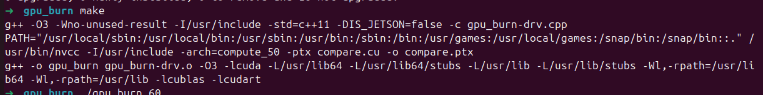
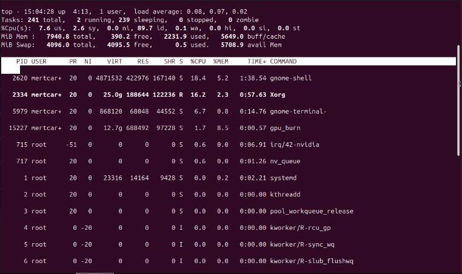
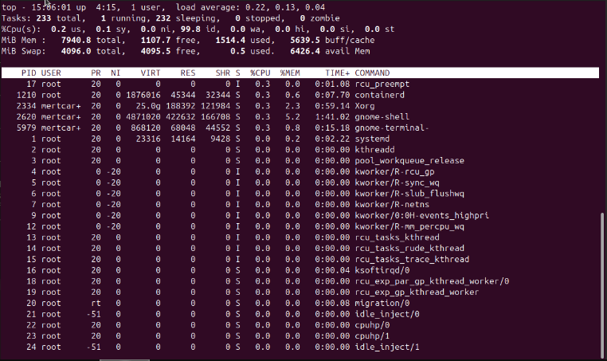
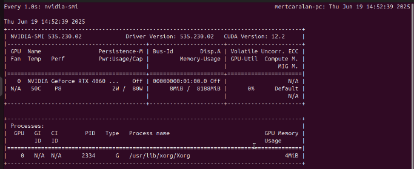
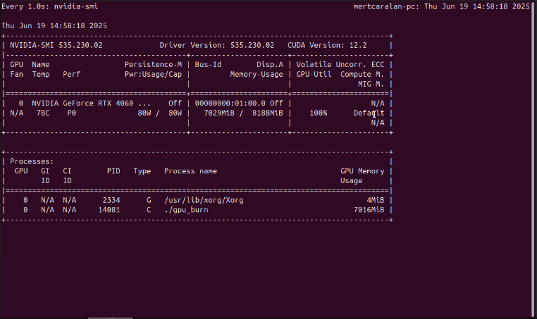
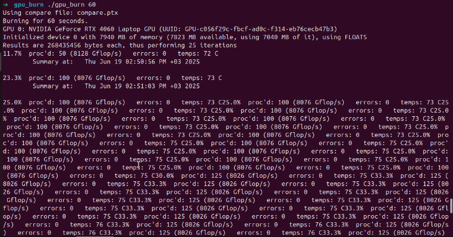
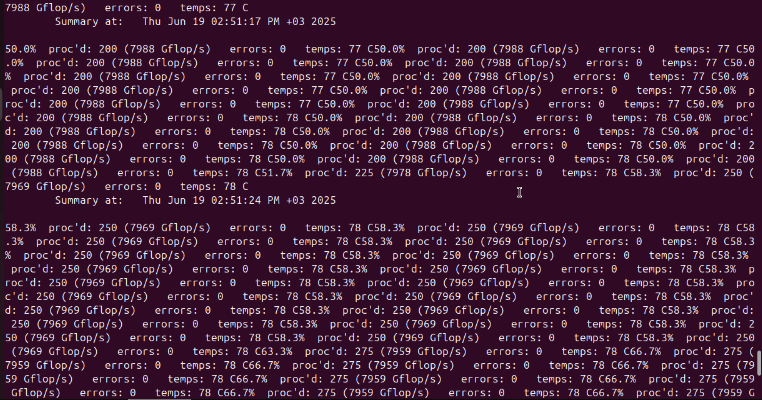
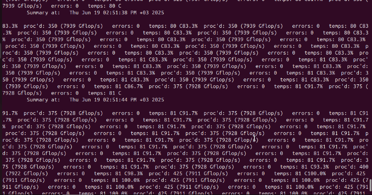
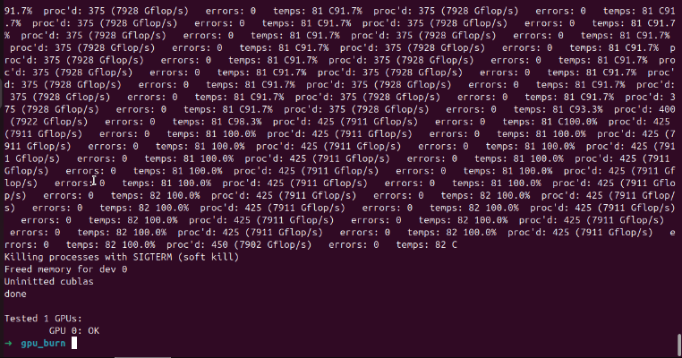
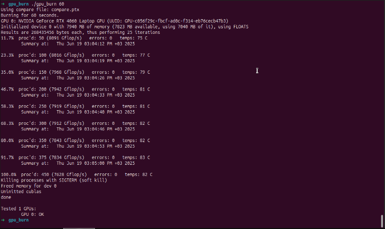

# 🗓️ Week 01 Report

**Dates:** 16–20 June 2025  
**Prepared by:** Mert Çaralan

---

## 🎯 Amaç ve Özet

Bu haftaki hedefim, kurumsal LLM altyapısı için GPU destekli bir ortam kurmak ve Proxmox üzerinde NVIDIA RTX 4060 ekran kartını passthrough ederek sanal Ubuntu VM içinde kullanabilir hale getirmekti. Kurulumun ardından gpu_burn benchmark testleri yaparak GPU’nun yük altında stabil çalıştığını doğruladım. Süreci belgeleyerek hem kişisel gelişimimi hem de ekibimizin bilgi birikimini artıracak bir kaynak oluşturdum.

---

## 🛠️ Hazırlık ve Kurulum Süreci

- **Proxmox VE 8 Kurulumu**
  - ISO dosyasını BalenaEtcher kullanarak USB belleğe yazdım.
  - ⚠️ Kendi bilgisayarıma kurulum yaptım; kurulum sırasında Proxmox tüm diski kapladığı için Windows işletim sistemim silindi.
  
- **Disk Analizi**
  - Ubuntu dual boot kurmayı planladım, ancak diskin neredeyse tamamının (%98) Proxmox tarafından kullanıldığını aşağıdaki komutlarla tespit ettim:
    ```bash
    lsblk
    fdisk -l
    gparted
    ```
  - Proxmox’u flash belleğe yedekledim:
    ```bash
    sudo dd if=/dev/nvme0n1 of=/media/sdb1/proxmox_backup.img bs=16M status=progress
    ```
  - Diskimi 450 GB Proxmox, 450 GB Ubuntu, 50 GB ortak alan olacak şekilde yeniden bölümlendirdim.
  
- **Dual Boot Problemi**
  - Ubuntu’yu kurduktan sonra Proxmox’u ayırdığım bölüme kurmayı denedim, ancak installer yalnızca tüm diski kullanmak istedi.  
  - Dual boot’un mevcut yapı ve disk kullanımı nedeniyle teknik olarak mümkün olmadığını fark ederek mentorumdan yeni bir bilgisayar talep ettim.

---

## 🖥️ Yeni Proxmox Ortamında VM Kurulumu

- Yeni bilgisayara Proxmox’u kurup 8006 portundan GUI erişimi sağladım.
- Kendi bilgisayarımdan tarayıcıyla Proxmox GUI’ye bağlandım.
- Ubuntu 22.04 sanal makinesini oluşturdum.
- GNOME masaüstü ve SSH kurulumlarını yaptım:
  ```bash
  sudo apt update && sudo apt install ubuntu-desktop openssh-server -y
  sudo systemctl enable --now ssh
````

* SSH anahtar yönetimini gerçekleştirdim:

  ```bash
  ssh-keygen -t ed25519 -C "mertcaralan16@gmail.com"
  ssh-copy-id root@192.168.1.105
  ```

---

## 🎨 GPU Passthrough Yapılandırması

* NVIDIA RTX 4060 ekran kartını VM’e PCI passthrough yaptım.
* Proxmox host üzerinde GRUB ve VFIO ayarlarını aşağıdaki gibi yapılandırdım:

  ```bash
  sudo nano /etc/default/grub
  # GRUB_CMDLINE_LINUX_DEFAULT="quiet intel_iommu=on iommu=pt pcie_acs_override=downstream,multifunction nofb nomodeset video=vesafb:off,efifb:off"
  sudo update-grub
  ```
* VFIO modüllerini /etc/modules dosyasına ekledim, blacklisting ve initramfs güncellemelerini tamamladım:

  ```bash
  echo "blacklist nouveau" >> /etc/modprobe.d/blacklist.conf
  update-initramfs -u
  ```

---

## 📊 GPU Tanıma ve Kontrol

* GPU’nun VM tarafından tanındığını aşağıdaki komutlarla doğruladım:

  ```bash
  lspci | grep -i nvidia
  nvidia-smi
  ```
* Çıktılarda NVIDIA RTX 4060’ın doğru şekilde VM’e bağlı olduğunu ve kullanılabilir durumda olduğunu gözlemledim.

---

## 🔥 GPU Benchmark Süreci

* gpu\_burn kurulumunu tamamlayıp 60 saniyelik stres testlerini gerçekleştirdim:

  ```bash
  git clone https://github.com/wilicc/gpu-burn.git
  cd gpu-burn && make
  ./gpu_burn 60
  watch -n 1 nvidia-smi
  ```
* Test sırasında:

  * GPU %100 kullanım seviyesine ulaştı.
  * Maksimum sıcaklık 82°C oldu.
  * Bellek kullanımı 7 GB civarında gerçekleşti.
  * Performans ortalama 7911–7928 GFlops aralığında ölçüldü.
  * Çıktıda “GPU 0: OK” ibaresi görüldü, bu GPU’nun stabil ve hatasız çalıştığını doğruladı.
  * CPU kullanımı %1’in altındaydı → yük tamamen GPU tarafından işlendi.

---

## 📸 Ekran Görüntüleri

Benchmark sürecini adım adım belgeleyen önemli ekran görüntüleri:

- **Benchmark Derleme Komutu (Pre-Benchmark Compilation Command)**  
  

- **Stres Testi Öncesi Sistem Kaynakları (top çıktısı)**  
  

- **Stres Testi Sırasında Sistem Kaynakları (top çıktısı)**  
  

- **Stres Testi Öncesi GPU Durumu (nvidia-smi çıktısı)**  
  

- **Stres Testi Sırasında GPU Durumu (nvidia-smi çıktısı)**  
  

- **İlk GPU Burn 60s Testi**  
  
  
  
  

- **İkinci GPU Burn 60s Testi**  
  

---

## 📎 Kullanılan Kaynaklar

* [GPU Burn GitHub](https://github.com/wilicc/gpu-burn)
* [Medium - GPU Passthrough](https://medium.com/@cactusmccoy/gpu-access-from-a-virtual-machine-on-proxmox-server-ubuntu-vm-903bb9783cb3)
* [Youtube - GPU Burn Setup](https://www.youtube.com/watch?v=kqZNFD0JNBc&t=411s)

---

## 📝 Öğrenilenler

* EFI/GRUB yapılandırmasının dual boot ve GPU passthrough senaryolarındaki kritik rolü.
* Proxmox’ta VM’e fiziksel GPU atanmasının adım adım süreci.
* GPU benchmark sonuçlarının yorumlanması ve stabilite analizi.
* GNOME ve SSH kurulumlarıyla VM’e uzaktan erişimin nasıl sağlanacağı.

---

## ✅ Sonuç

Bu haftanın sonunda, Proxmox ortamında NVIDIA RTX 4060 ekran kartının sanal Ubuntu VM’e başarıyla passthrough edilip, gpu\_burn benchmark testlerinde stabil ve hatasız çalıştığı doğrulanmıştır. Sistem, kurumsal LLM iş yükleri için hazır hale getirilmiştir.
