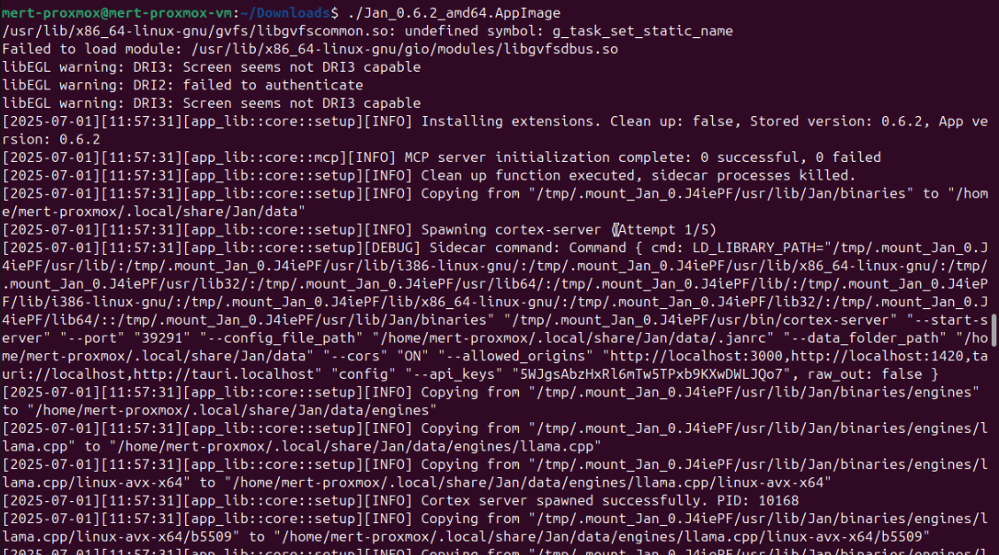
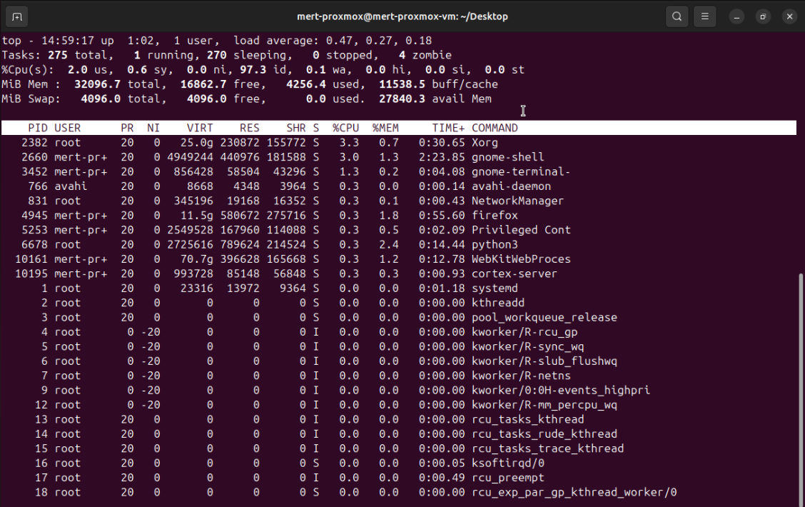
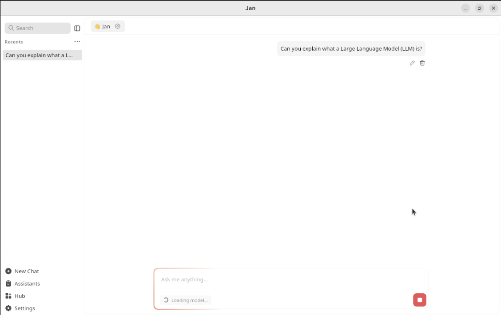
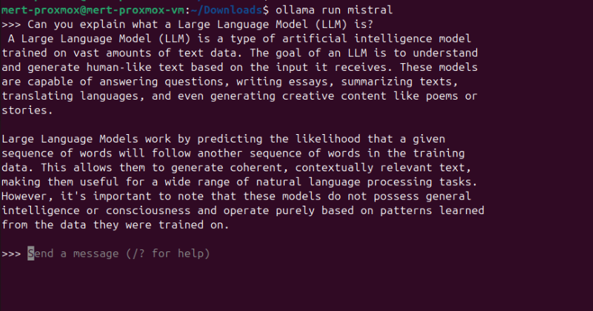

# 🗓️ Week 02 Report

* **Dates:** 23–27 June 2025
* **Prepared by:** Mert Çaralan

---

## 🎯 Amaç ve Özet

Bu hafta, Proxmox VM üzerinde GPU passthrough yapılan Ubuntu ortamına Ollama ve Mistral kurulumlarını tamamlayarak LLM altyapısını çalışır hale getirmeyi hedefledim. Terminalde modelleri başarıyla çalıştırdım; Web UI tarafında yanıt alınamayan sorunu detaylı analiz ederek mentoruma raporladım. API performans testlerine hazırlık yaptım ve Edge AI donanımları hakkında araştırmalar gerçekleştirerek teknik bilgi seviyemi artırdım.

---

## 🛠️ Ortam Kurulumu ve Model Çalıştırma

* Proxmox VM’de Ubuntu’ya Docker, Python ve gerekli araçları kurarak çalışma ortamını hazırladım:

  ```bash
  sudo apt update && sudo apt install docker.io python3 python3-pip -y
  sudo systemctl enable --now docker
  ```

* NVIDIA sürücülerini yükleyip GPU passthrough’un aktif çalıştığını benchmark testleriyle doğruladım.

* Ollama ve Mistral kurulumlarını tamamladım:

  ```bash
  curl -fsSL https://ollama.com/install.sh | sh
  ollama pull mistral
  ollama run mistral
  ```

* Terminalde ilk testte promptlara hızlı yanıt aldım; Mistral stabil çalışıyordu.

---

## ⚠️ Karşılaşılan Sorunlar ve Çözümler

* **Terminalde Sonsuz Döngü Sorunu**

  * Sorun: Mistral, verdiği yanıtı yeni prompt olarak algılayarak döngüye giriyordu.
  * Çözüm: Ollama konfigürasyon dosyasına delimiter ekleyerek ve Jan.AI’de assistant instructions kısmına aşağıdaki kuralı yazarak sorunu çözdüm:

    ```json
    {
      "keep_alive": false,
      "delimiter": "### Response:"
    }
    ```

    **Instruction:** You must not treat your own responses as user input. Only respond to new user messages. Never repeat your own replies back as user input.

* **Web UI’de Yanıt Alınamaması**

  * Sorun: Web UI’de promptlara cevap alınamıyordu.
  * Aksiyon: top komutuyla sistem kaynak kullanımını kontrol ettim; CPU ve RAM darboğazı olmadığını ve RAM’i artırmama rağmen sorunun devam ettiğini tespit ettim. Terminal üzerinden çalışmaya devam ettim.

---

## 📝 Mentor İletişimi ve Geri Bildirimler

* Web UI’de yanıt alınamadığını mentoruma raporladım; terminalde sorunsuz çalıştığını bildirdim.
* Bora Bey’in önerileri:

  * RAM kullanımını ve sistem yükünü top komutuyla takip et.
  * API performansını ölçmek için aşağıdaki araçlarla test yap:

    * [Hello World Curl Örneği](https://github.com/llm-edge/hal-9100/blob/main/examples/hello-world-mistral-curl/README.md)
    * [Python API Client](https://github.com/rogerkibbe/simple-mistral-api-client)
    * [Python Süre Ölçümü](https://www.geeksforgeeks.org/python/python-measure-time-taken-by-program-to-execute/)

---

## 🔍 API Performans Testi Ön Hazırlıkları

* curl ve Python kullanarak API performans testi için ön araştırmaları tamamladım.
* Terminal ve Web UI performans farkını anlamaya yönelik senaryolar oluşturdum.

---

## 📸 Ekran Görüntüleri

* **Mistral Modelinin Ollama Üzerinden Çekilmesi**
  

* **Jan Web UI Başlatılırken Terminal Logları**
  

* **Sistem Kaynak Kullanımı (top çıktısı)**
  

* **Web UI’de Gönderilen Prompt ve Bekleme Durumu**
  

* **Terminalde Başarılı LLM Yanıtı**
  

---

## 📝 Off-Topic Çalışma: Edge AI Donanım Araştırması

* Bora Bey’in önerisiyle EdgeCortix SAKURA-II kartını detaylıca inceledim.
* Kartın düşük güç tüketimli Edge AI uygulamalarında sağladığı avantajlarını, Dynamic Neural Accelerator mimarisi ve kullanım senaryolarını araştırdım.
* [SAKURA-II Ürün Sayfası](https://www.edgecortix.com/en/products/sakura)

---

## 📝 Öğrenilenler

* Ollama ve Mistral kurulum süreçleri.
* Terminalde LLM prompt yönetimi ve sonsuz döngü sorunlarının çözümü.
* API performans testi hazırlıkları.
* Edge AI donanımları hakkında ileri düzey bilgi.

---

## ✅ Sonuç

Week 02’de LLM altyapısını terminalde sorunsuz çalıştırdım. Web UI’deki yanıt sorununu detaylı analiz ederek mentoruma raporladım ve API performans testlerine hazırlık yaptım. Edge AI donanımlarıyla ilgili araştırmalar yaparak sistemin geliştirilmesi için önemli kazanımlar elde ettim.
