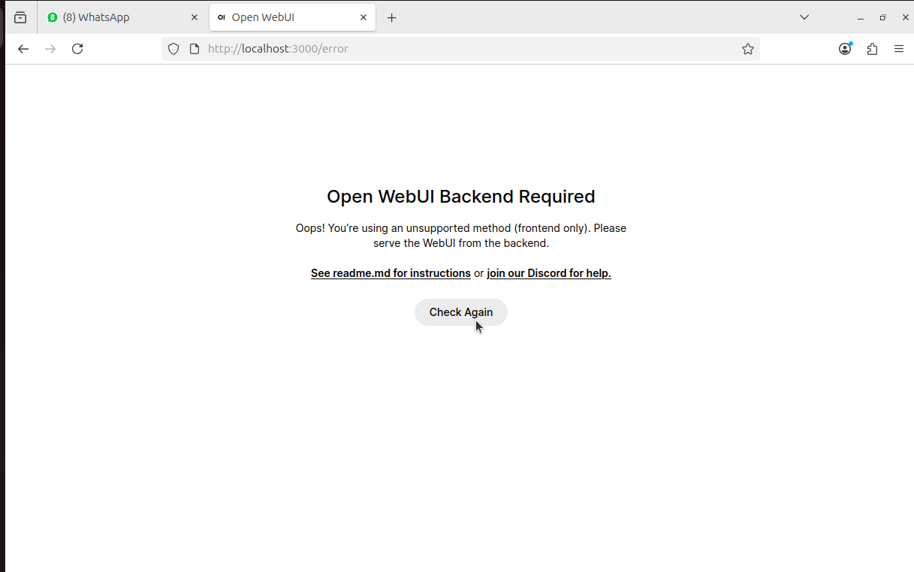
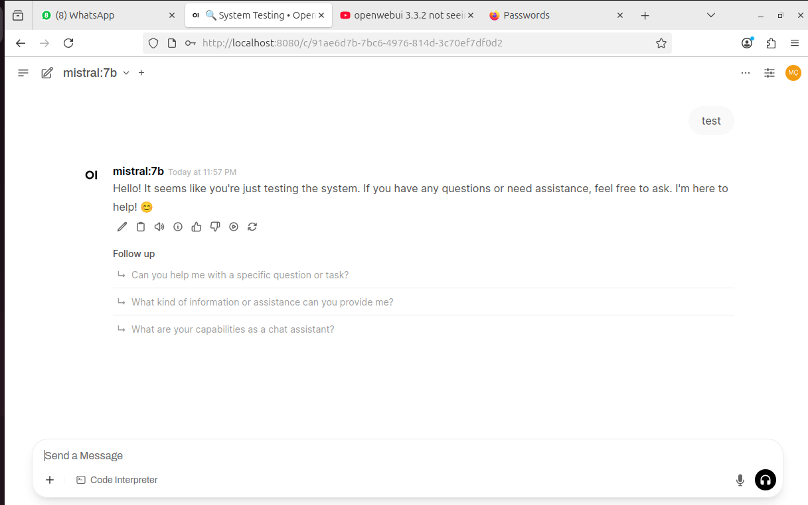
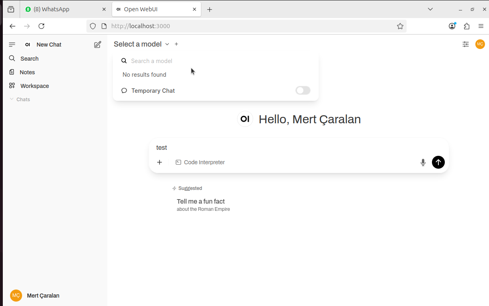
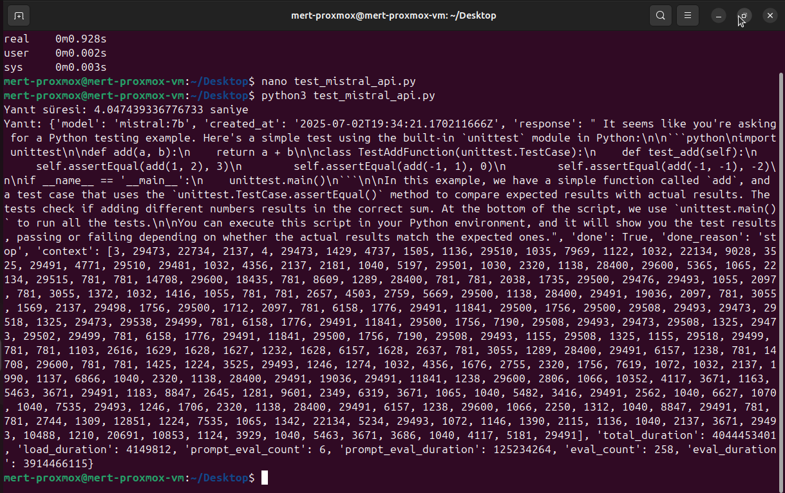
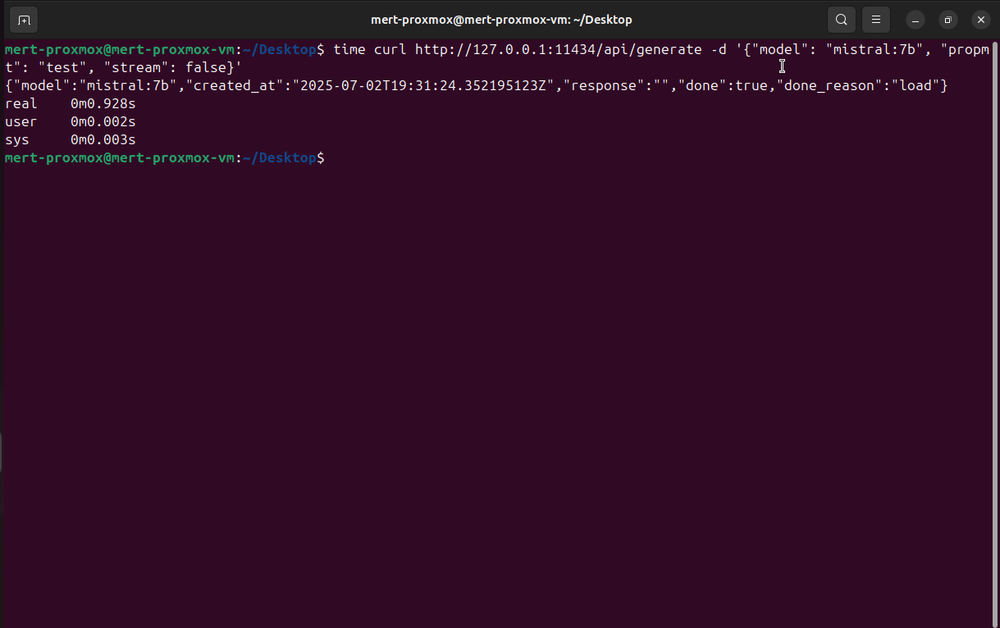
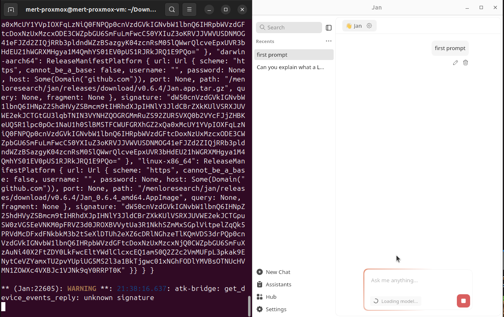

# 🗓️ Week 03 Report

* **Dates:** 30 Haziran – 5 Temmuz 2025
* **Prepared by:** Mert Çaralan

---

## 🎯 Amaç ve Özet

Bu hafta, **Proxmox VM kurulumu**, **Proxmox’a uzaktan erişim için NAT/Port yönlendirme**, **LLM kurulumları**, **Open WebUI ile model entegrasyonu** ve **Veeam Technical Sales Professional (VMTSP)** kursu gibi önemli görevleri başarıyla tamamladım. Ayrıca, **TS EN 50600 Veri Merkezi Tesisleri ve Altyapıları Standardı** eğitimini de başarıyla tamamlayarak **veri merkezi altyapıları** konusunda bilgimi pekiştirdim. Özellikle, **Jan.ai**'daki bağlantı problemleri nedeniyle **Open WebUI**’ye geçiş yapmak zorunda kaldım ve burada da **port yönlendirme hatası** gibi sorunlarla karşılaştım. Bu hataları çözüme kavuşturarak, WebUI üzerinden **Mistral modelinin** doğru şekilde çalışmasını sağladım.

Ayrıca, **performans testleri** yaparak **API yanıt sürelerini** optimize ettim ve geçiş sırasında karşılaştığım her sorunla ilgili çözüm süreçlerini belgelerken önemli deneyimler kazandım. **Mentor** ile yapılan görüşmeler ve geri bildirimler doğrultusunda, bu süreçlerin her biri daha sistematik hale getirildi ve iş süreçlerine daha derinlemesine bir katkı sağlandı.

---

## 🛠️ Adım Adım Yapılan Çalışmalar

## 1️⃣ **Proxmox’a Uzaktan Erişim için NAT/Port Yönlendirme**

**Nedensellik:**

Proxmox VM'lerine artan erişim ihtiyacı nedeniyle, dış ağdan erişim sağlamak amacıyla **NAT yapılandırması** gerçekleştirdim. Bu işlem, **Proxmox web arayüzüne (8006 portu)** dışarıdan bağlanabilmeyi sağladı. **Proxmox VM'lerini** ofis dışından yönetmek için bu çözüm kritik bir adımdı. Ayrıca, **network yapılandırmaları** ve **port yönlendirme** ayarlarının doğruluğu, sistemin sağlıklı çalışabilmesi için çok önemlidir.

**Yapılan İşlemler:**

### 1.1) **Modem Arayüzüne Giriş Yapılması:**

* Modem arayüzüne erişmek için, **web tarayıcı üzerinden** [http://192.168.1.1](http://192.168.1.1) adresine giderek modem arayüzüne giriş yaptım. Bu işlem için, **admin kullanıcı adı** ve **superonline şifresi** kullanarak yönetici olarak oturum açtım.

### 1.2) **Port Yönlendirme Menü Seçeneği Bulundu:**

* **Gelişmiş > İşletme Kuralı > IPv4 Port Eşleştirme** menüsüne giderek, dış IP üzerinden gelen bağlantıların iç ağdaki **Proxmox sunucusuna** yönlendirilmesi için gerekli ayarları yaptım.

### 1.3) **Port Yönlendirme Kuralının Oluşturulması:**

* **Eşleştirme Adı:** `Proxmox`
* **WAN Adı:** `WAN_INTERNET`
* **Dahili IP (Internal Host):** `192.168.1.105`
* **Protokol:** TCP
* **Harici Port Başlangıç/Bitiş:** 8006 - 8006
* **Dahili Port Başlangıç/Bitiş:** 8006 - 8006

### 1.4) **Port Yönlendirme Kuralının Aktifleştirilmesi:**

* Yapılan **port yönlendirme** kuralını aktif hale getirmek için **“Etkinleştir”** kutusunu işaretledim ve ardından **“Ekle”** butonuna basarak kuralı kaydettim. Değişikliklerin geçerli olması için **“Uygula”** butonuna tıklayarak işlemi tamamladım.

### 1.5) **Erişim Testi:**

* **[WhatIsMyIP.com](https://www.whatismyip.com)** üzerinden ofisin **dış IP adresini** öğrendim ve doğru yapılandırmanın çalışıp çalışmadığını test ettim. Sonrasında, tarayıcıya şu URL’yi yazarak **Proxmox web arayüzüne** bağlandım:

  ```
  https://ofis_dış_ip:8006
  ```

  Bu test sırasında, **Proxmox’a dış ağdan başarılı şekilde bağlandım**. Böylece, **port yönlendirme işleminin doğru yapıldığı** ve **uzaktan erişim sağlandığı** doğrulanmış oldu.

---

## 2️⃣ **Jan.ai ile Bağlantı Sorunları ve Çözümü**

**Nedensellik:**

Başlangıçta **Jan.ai** üzerinden **LLM yönetmeye** çalıştım. Ancak, sürekli **"internal error"** alıyor ve **cortex-server** servisi sürekli çöküyordu. Bu tür bağlantı sorunları, **Jan.ai**'nin **Ollama API** ile uyumsuz çalıştığını gösteriyordu. Bu sebeple, **Jan.ai** yerine **Open WebUI**'yi kullanmaya karar verdim. **API testleri** ve **port yönlendirme** gibi konularda mentor ile yaptığımız görüşmeler doğrultusunda daha sağlıklı bir çözüm buldum.

**Yapılan İşlemler:**

### 2.1) **Jan.ai Kurulumu ve Bağlantı Sorunu:**

* **Jan.ai** kurulumunu tamamladım ve GUI üzerinden **Mistral modelini** yüklemeye çalıştım. Ancak model yüklenemedi ve sürekli **“internal error”** mesajları aldım.

* **Hata logları** şu mesajı içeriyordu:

  ```
  cortex-server unexpectedly stopped
  ```
  
### 2.2) **Çözüm ve Sonuç:**

* **Jan.ai**’da yaşadığım **bağlantı sorunlarını** mentoruma bildirdikten sonra, **Open WebUI**’yi kurarak devam etmeye karar verdim.
* **Open WebUI**'yi Docker üzerinden kurarak **Mistral modelinin stabil çalışmasını** sağladım.

---

## 3️⃣ **Open WebUI Kurulumu ve Port Mapping Sorunu**

**Nedensellik:**

**Open WebUI**’yi kullanmaya karar verdim çünkü **Jan.ai** bağlantı problemleri nedeniyle düzgün çalışmıyordu. **Cortex-server**’ın sürekli çökmesi ve **Ollama API**’ye bağlanamaması nedeniyle **Jan.ai**'nin geçici olarak kullanılamaz hale gelmesi, **Open WebUI**'yi kullanmam için bir fırsat sundu. Ancak, **Open WebUI** kurulumunda da **port yönlendirme hatası** nedeniyle **modelin görünmemesi** gibi bir sorunla karşılaştım.

**Yapılan İşlemler:**

### 3.1) **Docker ile Open WebUI Kurulumu:**

* **Docker** kullanarak **Open WebUI** kurulumunu gerçekleştirdim:

  ```bash
  docker run -d -p 3000:8080 --add-host=host.docker.internal:host-gateway -v open-webui:/app/backend/data --name open-webui --restart always ghcr.io/open-webui/open-webui:main
  ```

### 3.2) **Port Yönlendirme Sorunu:**

* İlk başta, **3000 portunu** **container içindeki 3000**’e yönlendirdim. Ancak **backend servisi aslında 8080 portunda** çalışıyordu.
* **Port yönlendirmesini düzelttim:**

    ```bash
    docker run -d -p 3000:8080 --add-host=host.docker.internal:host-gateway -v open-webui:/app/backend/data --name open-webui --restart always ghcr.io/open-webui/open-webui:main
    ```
### 3.3) **Sonuç:**

* **Model Seçimi Sorunu:** Port yönlendirmesini düzeltikten sonra, **Open WebUI** üzerinden **Mistral modelini** **görmeye başladım**. Modelin doğru şekilde yüklenmesi, **port yönlendirme hatasının** düzeltilmesiyle mümkün oldu.

---

## 4️⃣ **Model Entegrasyonu ve Testi**

**Yapılan İşlemler:**

### 4.1) **Ollama API ile Test:**

* **Ollama API** üzerinden yüklü olan modelleri görmek için şu komutu kullandım:

  ```bash
  ollama list
  ```

* **Model görünürlüğü** doğrulandı.

### 4.2) **Modelin WebUI’de Görünmemesi:**

* **Modelin WebUI’de görünmemesi** sorunu, **port yönlendirme hatası** nedeniyle gerçekleşiyordu. Bu sorunu çözmek için **logları** inceleyip, **port yönlendirmesini** doğru yapılandırarak modelin görünmesini sağladım.

---

## 5️⃣ **Veeam Technical Sales Professional (VMTSP) Kursu**

**Sonuç:**

**Veeam Backup & Replication**, **Veeam ONE** ve **Kasten K10** gibi ürünlerle veri yedekleme ve felaket kurtarma süreçlerini yönetmeyi öğrendim. Bu kurs, **veri güvenliği** ve **iş sürekliliği** alanlarında bilgi seviyemi artırarak, **veri yedekleme** ve **kurtarma süreçlerini** daha verimli yönetme becerisi kazandım.

---

## 6️⃣ **TS EN 50600 Veri Merkezi Tesisleri ve Altyapıları Standardı Kursu**

**Sonuç:**

Bu kurs, **veri merkezi altyapılarının** nasıl tasarlanacağı ve güvenli bir şekilde **yönetileceği** hakkında derinlemesine bilgi edinmemi sağladı. Kurs, **veri merkezi güvenliği**, **enerji verimliliği** ve **felaket kurtarma** gibi kritik konularda **standartları** öğrenmeme olanak tanıdı.

---

## 📝 Mentor İletişimi ve Geri Bildirimler

* Jan.ai bağlantı sorununu mentoruma raporladım ve Open WebUI'yi kullanma kararı aldığımı bildirdim. Web UI üzerinden yaşadığım sorunları ve çözüm sürecini paylaştım.
  
* Mentor'umun önerileri:
  
     * API performansını ölçmek için curl ve Python araçlarını kullanarak yanıt sürelerini test etmem gerektiğini belirtti.
     * WebUI ve LLM arasındaki senkronizasyon için Uvicorn, Gunicorn ve Triton gibi araçları incelememi önerdi.
     * Port yönlendirme hatalarını düzelttikten sonra, WebUI ve API entegrasyonunun düzgün çalışması gerektiği konusunda rehberlik etti.

---

## 📸 Ekran Görüntüleri

* **Port Yönlendirme Hatası (Open WebUI)**
  

* **Port Yönlendirme Düzeltildikten Sonra Model Seçimi**
  

* **Model Seçiminde "No Result Found" Hatası**
  

* **API Test Python Sonuçları**
  

* **API Test Curl Sonuçları**
  

* **Jan.ai Model Yükleme Hatası**
  

---

## ⚠️ Karşılaşılan Sorunlar ve Çözümler

* Yapılan Çözümler:

1. **Jan.ai Bağlantı Sorunları:**
   **Jan.ai**’yi kullanamama durumu, **Open WebUI** tercih edilerek çözüme kavuşturuldu. **Ollama API** ile stabil bağlantı sağlandı.

2. **Port Yönlendirme Hatası:**
   Port yönlendirme hatası düzeltildikten sonra, **modelin WebUI’de görünmesi sağlandı** ve backend ile frontend arasındaki **iletişim düzenlendi**.

3. **API Performans Sorunları:**
   **Python** ile testler yapılarak, **yanıt süreleri optimize edildi** ve **API performansı iyileştirildi**.

* Sonuç:

**Jan.ai** ile yaşadığım bağlantı sorunlarını, **Open WebUI** kullanarak çözüme kavuşturdum ve **Mistral modelinin** doğru şekilde çalışmasını sağladım. **Port yönlendirme hatalarını** düzelterek, modelin **WebUI’de görünmesini** sağladım ve backend ile frontend arasındaki iletişimi düzenledim. **API performans sorunlarını** test ederek ve optimize ederek, modelin yanıt süresini hızlandırdım.

---

## 📝 Öğrenilenler

* Bu hafta boyunca teknik süreçlerin ve sistem entegrasyonlarının her aşamasında önemli dersler aldım. Özellikle karşılaştığım zorluklar ve çözüm süreçleri, bu adımların daha verimli ve sistematik bir şekilde nasıl yönetileceğini anlamama yardımcı oldu.

* Jan.ai ve Open WebUI Geçişi:

     * Jan.ai’de yaşadığım bağlantı sorunları ve cortex-server’ın sürekli çökmesi nedeniyle, Open WebUI'ye geçiş yaptım. Bu geçiş süreci, farklı araçlar arasında doğru entegrasyon sağlamak için ne kadar dikkatli ve detaylı çalışmam gerektiğini gösterdi. Bu deneyim, LLM yönetimi ve API bağlantılarını yönetme konusunda güçlü bir temel oluşturdu.
     * Mentor'un geri bildirimi doğrultusunda, Open WebUI'yi Docker üzerinden kurarak, her adımı doğru şekilde takip ettim ve modelin düzgün çalışmasını sağladım. Bu süreçte Jan.ai yerine Open WebUI’nin daha stabil bir çözüm sunduğunu gözlemledim.

* Port Yönlendirme ve Model Entegrasyonu:

     * Port yönlendirme hatalarını düzeltmek, modelin doğru şekilde WebUI’de görünmesini sağlamak için çok kritik bir adımdı. Başlangıçta 3000:3000 port yönlendirmesi yapılırken, backend servisi 8080 portunda çalışıyordu. Bu hatayı fark ettikten sonra, doğru port yönlendirmesini yaparak modelin WebUI üzerinden düzgün şekilde görünmesini sağladım. Bu deneyim, network yapılandırmalarında dikkat edilmesi gereken detayları ve yanıt gecikmelerine neden olan hataları anlamama yardımcı oldu.

* API Performansı ve Testler:

     * API performans testleri yaparak yanıt sürelerini ölçtüm ve çeşitli testlerle performans iyileştirmeleri gerçekleştirdim. Curl ve Python kullanarak testler yaparak, yanıt sürelerinin optimize edilmesi gerektiğini öğrendim. Bu süreç, API performansını izlemek ve optimize etmek için kullanılan araçların gücünü ve önemini bana gösterdi.
     * Mentor'un önerdiği Uvicorn, Gunicorn, ve Triton gibi araçlarla WebUI ve LLM senkronizasyonu konusunda derinlemesine bir anlayış kazandım. Bu araçların doğru kullanımı, yük dengeleme ve asenkron/senkron dönüşüm konularında önemli ilerlemeler kaydetmeme olanak sağladı. Yüksek performans gerektiren API istekleri için bu araçların nasıl kullanılacağına dair derinlemesine bilgi edinmiş oldum.

* Mentor’un Geri Bildirimi ile Sistematik Çalışma:

     * Mentor’un geri bildirimleri sayesinde, her aşamada daha sistematik bir yaklaşım geliştirmeye başladım. API performansını test ederken ve port yönlendirme hatalarını giderirken, her sorunun arkasındaki temel sebebi anlamaya çalıştım. Bu süreç, karşılaşılan teknik sorunları sistematik bir şekilde ele almak ve her bir çözümü belgeleyerek gelecekteki stajyerlere referans oluşturmak adına çok öğreticiydi.

* Dokümantasyonun Önemi:

     * Bu hafta boyunca yazdığım dökümantasyon, hem kendim hem de ekip arkadaşlarım için çok değerli bir referans kaynağı oluşturdu. Proxmox kurulumundan Open WebUI entegrasyonuna, port yönlendirme hatalarının çözülmesinden model entegrasyonuna kadar tüm adımları adım adım belgeledim. Bu dökümantasyon, başka ekip üyeleri veya gelecekteki stajyerler için önemli bir rehber olacak.

* Sürekli İyileştirme ve Öğrenme:

     * Bu hafta boyunca, sürekli iyileştirme felsefesi ile ilerleyerek, her bir hata ve zorluk sonrasında daha fazla bilgi edinmeye çalıştım. Yalnızca teknik bilgimi değil, aynı zamanda proje yönetimi, sorun çözme ve yazılım entegrasyonu becerilerimi de geliştirdim. Mentor'un rehberliğinde test odaklı yaklaşım ve adım adım süreç yönetimi konusunda önemli dersler aldım.
        
---

## ✅ Sonuç

* Mentorumun geri bildirimi doğrultusunda, her aşamada daha sistematik bir yaklaşım geliştirdim. Bu süreçte karşılaşılan her türlü sorunu çözerek, Open WebUI ve Ollama API entegrasyonunu başarıyla tamamladım. Port yönlendirme hatalarını düzelterek, modelin WebUI üzerinden görünmesini sağladım. Ayrıca, performans iyileştirme ve senkronizasyon konularında Mentor'un önerdiği araçları kullanarak önemli ilerlemeler kaydettim. Bu hafta, teknik zorlukları aşarken öğrendiğim dersler, projelere daha proaktif ve çözüm odaklı yaklaşmamı sağladı.
